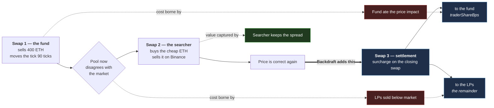
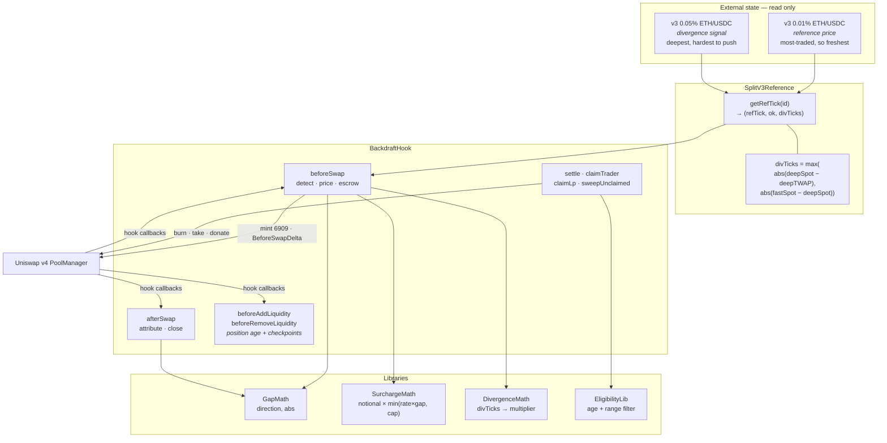
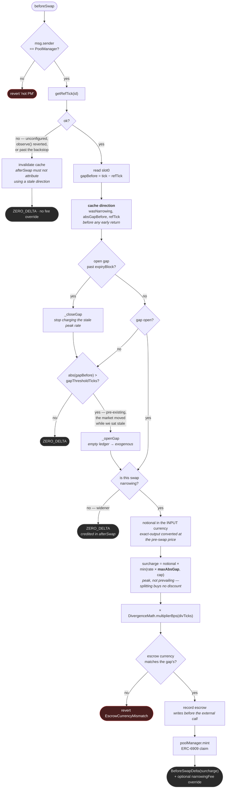
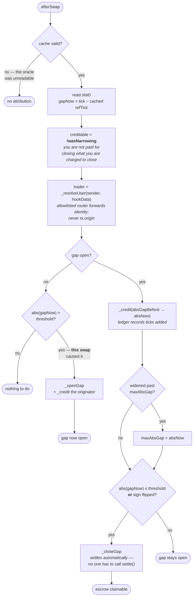
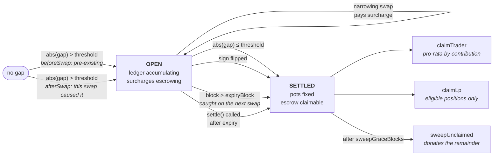
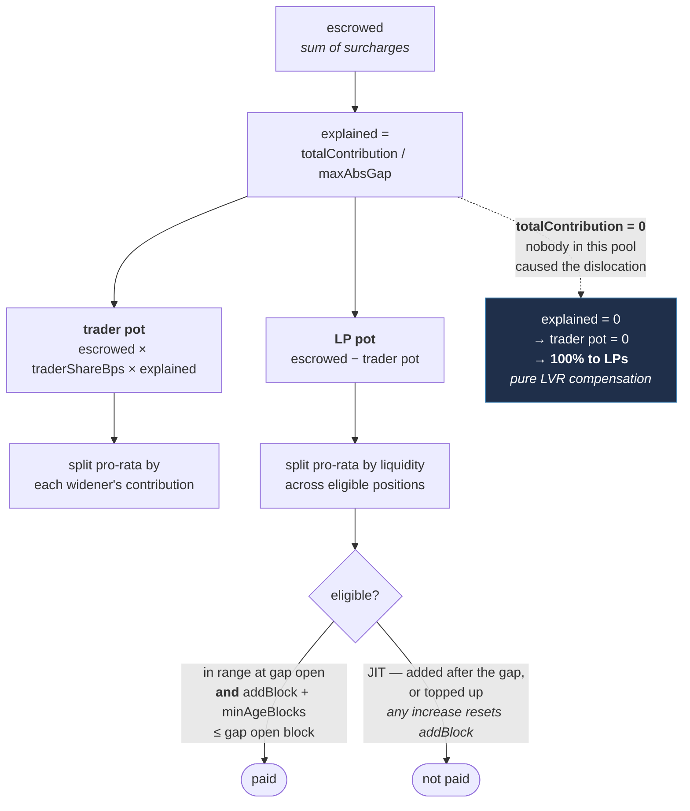
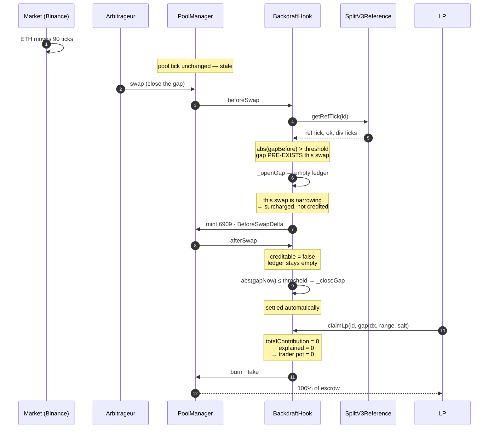
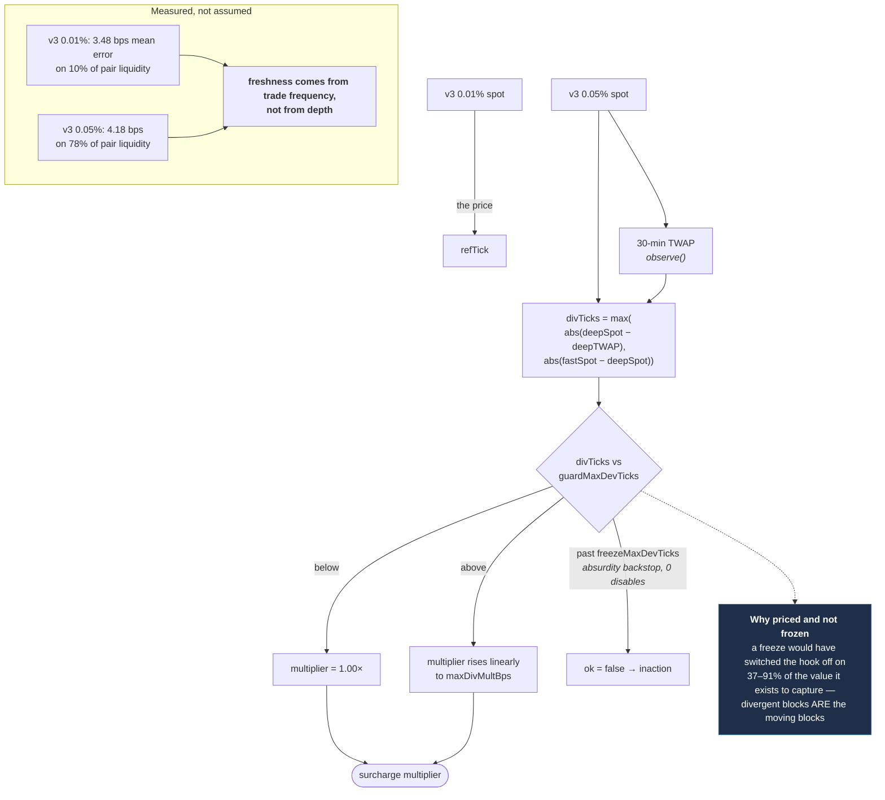
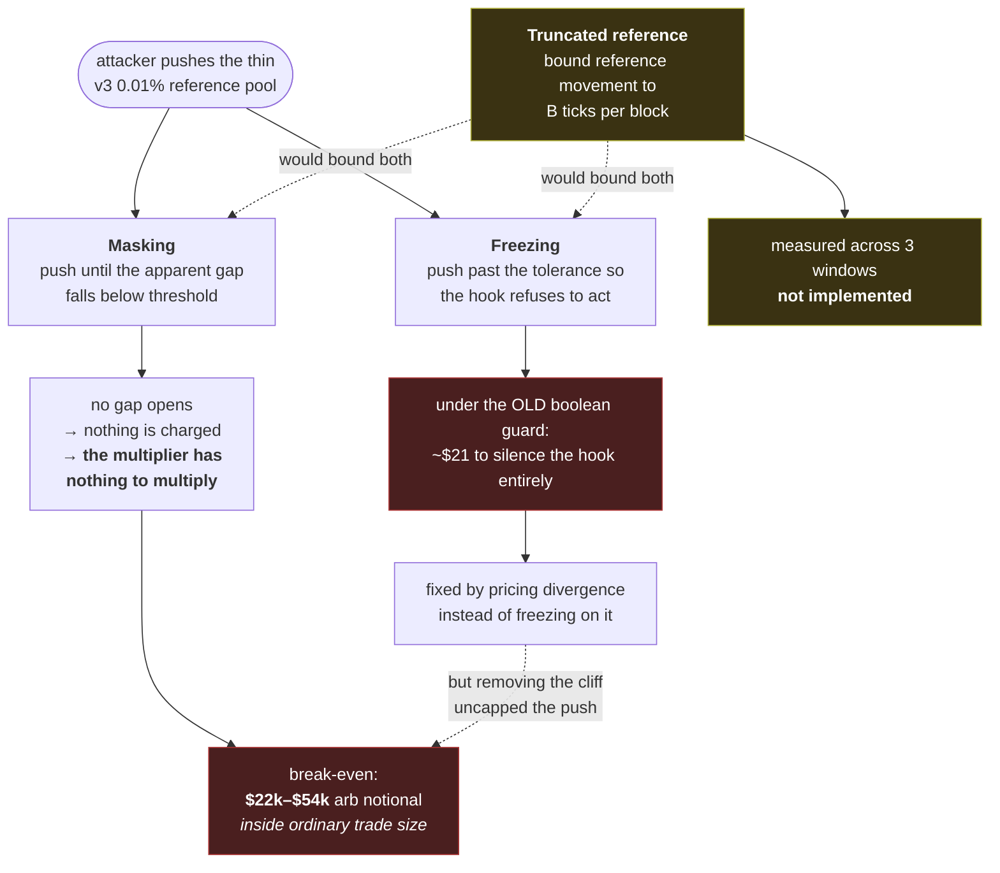

# Backdraft — Architecture

Diagrams are generated from the code in `src/`, not from the design docs. Where the two
disagree, the code wins and the diagram follows the code.

All diagrams are Mermaid `flowchart` or `sequenceDiagram`, both of which import into
Excalidraw via **mermaid-to-excalidraw** (`Excalidraw → Insert → Mermaid`). `stateDiagram`
and `erDiagram` do **not** import cleanly, so the gap lifecycle below is drawn as a
flowchart rather than a state machine on purpose.

---

## 1. The idea, in one picture

The three swaps: the one that creates the dislocation, the one that profits from it, and
the settlement that doesn't exist on an ordinary pool.

---

## 2. Component layout

---

## 3. `beforeSwap` — detect, price, escrow

Every early return is a real branch in the code. The order matters: direction is decided
on the **pre-swap** gap and cached, before any early return, because a swap that is not
surcharged can still be a legitimate widener.

---

## 4. `afterSwap` — attribute and close

---

## 5. Gap lifecycle

Drawn as a flowchart rather than a `stateDiagram` so it imports into Excalidraw.

---

## 6. Settlement split — where the money goes

The exogenous case is not a branch. It is what the formula returns when nothing widened
the gap.

---

## 7. End to end — the exogenous case

The one the project exists for: the market moves, this pool sits stale, an arbitrageur
corrects it, and the LPs are compensated without anyone having caused anything.

---

## 8. Reference price — why two pools

---

## 9. Attack surface

Both attacks are the same attack. No single tolerance closes both — this is a stated
limitation, not a solved problem.

